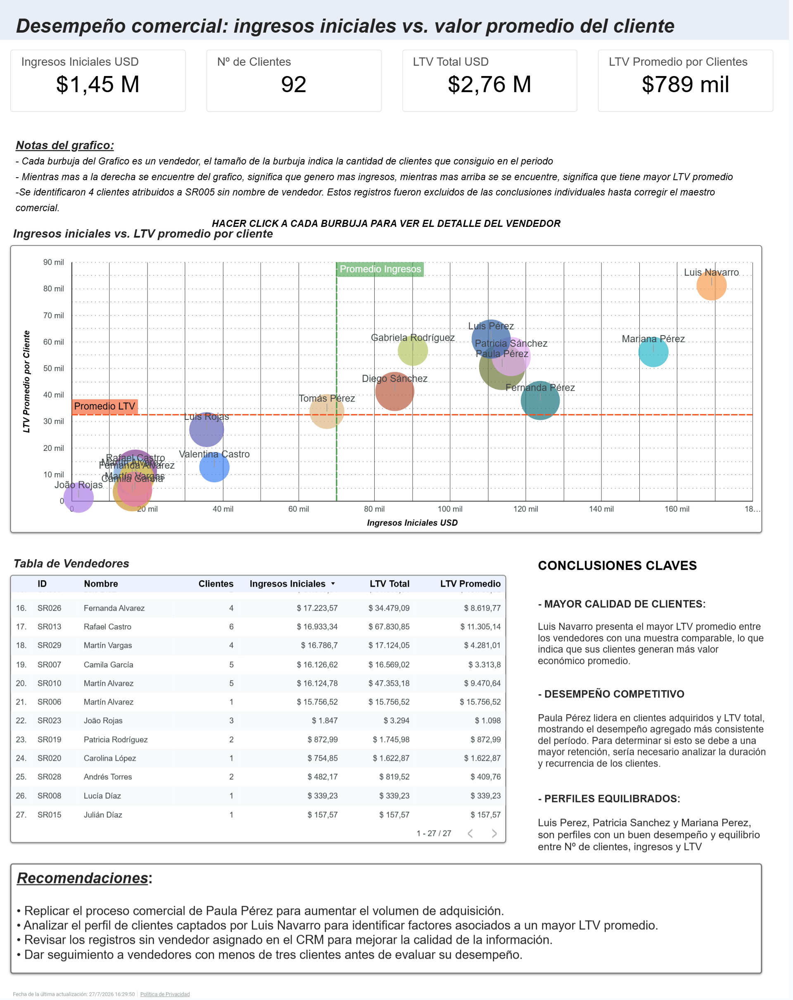

# Análisis del Desempeño Comercial con SQL y Power BI

### Evaluando el desempeño de los vendedores mediante adquisición de clientes y Customer Lifetime Value (LTV).

---

## Habilidades Demostradas

- SQL Server
- Análisis de Negocio
- Limpieza y Validación de Datos
- Diseño de KPIs
- Customer Lifetime Value (LTV)
- Power BI
- Git y GitHub

---

## Descripción del Proyecto

Este proyecto analiza el desempeño comercial desde una perspectiva de negocio.

En lugar de identificar únicamente quién vendió más, el objetivo es determinar **qué vendedores adquirieron los clientes más valiosos**, combinando adquisición de clientes, ingresos iniciales y Customer Lifetime Value (LTV).

---

## Pregunta de Negocio

> **¿Quiénes son realmente los mejores vendedores de la empresa?**

Para responder esta pregunta, el desempeño comercial se evaluó utilizando cuatro indicadores de negocio en lugar de considerar únicamente los ingresos.

- Clientes adquiridos
- Ingresos iniciales
- Customer Lifetime Value (LTV) total
- Customer Lifetime Value (LTV) promedio por cliente

---

## Enfoque del Análisis

El proyecto siguió el siguiente proceso:

1. Auditoría de la calidad de los datos.
2. Definición de reglas de negocio para la adquisición de clientes.
3. Normalización de todas las monedas a USD.
4. Asignación correcta de cada cliente a su vendedor.
5. Cálculo del Customer Lifetime Value (LTV).
6. Desarrollo de un dashboard interactivo en Power BI.

---

## Impacto para el Negocio

Este análisis propone una forma más completa de evaluar el desempeño comercial, combinando adquisición de clientes, ingresos iniciales y Customer Lifetime Value (LTV).

De esta manera es posible identificar no solo a los vendedores que más venden, sino también a aquellos que generan mayor valor para la empresa en el largo plazo.

---

## Dashboard

El dashboard resume el desempeño comercial utilizando adquisición de clientes, ingresos iniciales y Customer Lifetime Value.



---

## Principales Hallazgos

- Evaluar únicamente los ingresos puede generar rankings comerciales engañosos.
- Algunos vendedores adquirieron menos clientes, pero consiguieron clientes con mayor valor promedio.
- Fue necesario definir reglas de negocio para asignar correctamente cada cliente a su vendedor.
- La estandarización de todas las monedas a USD permitió realizar comparaciones consistentes entre vendedores.

---

## Recomendaciones de Negocio

- Replicar las prácticas comerciales de los vendedores con mejor desempeño.
- Analizar el perfil de los clientes asociados a un mayor Customer Lifetime Value (LTV).
- Mejorar la calidad del CRM corrigiendo registros sin vendedor asignado.
- Analizar la retención de clientes para comprender mejor el desempeño comercial a largo plazo.

---

## Estructura del Proyecto

```text
sales-performance-analysis/
│
├── sql/
│   ├── 01_data_quality_checks.sql
│   ├── 02_business_rules_and_attribution.sql
│   ├── 03_customer_ltv_calculation.sql
│   └── 04_sales_performance_analysis.sql
│
├── docs/
│
└── images/
```

---

## Herramientas Utilizadas

- SQL Server
- T-SQL
- Power BI
- Git
- GitHub

---

## Conclusión

Este proyecto demuestra cómo la combinación de reglas de negocio, adquisición de clientes y Customer Lifetime Value (LTV) permite construir una evaluación del desempeño comercial mucho más completa que un análisis basado únicamente en ingresos.

---

## Autor

**Yxel Morillo**

Business Analyst | Data Analyst

- LinkedIn: https://www.linkedin.com/in/yxel-morillo/
- GitHub: https://github.com/yxelmorillo
